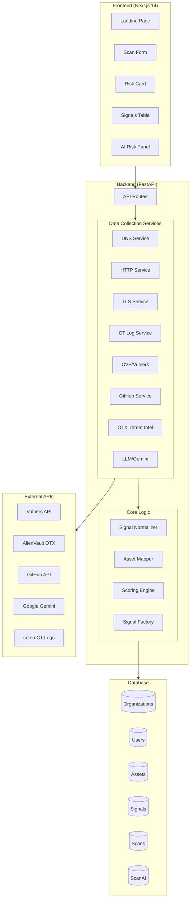
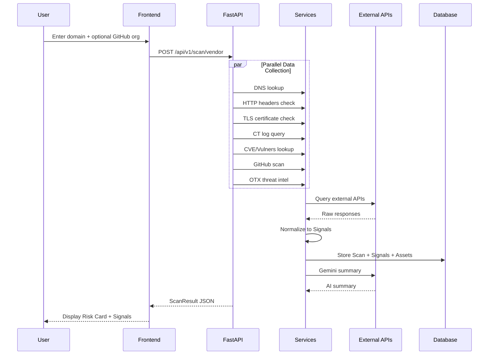
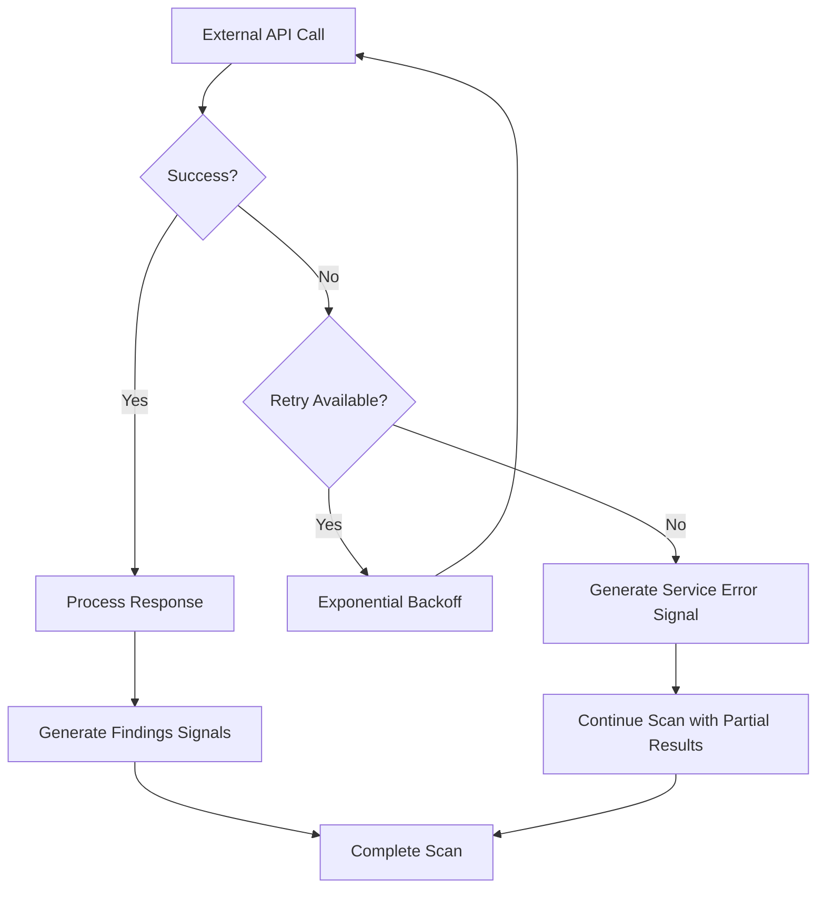

# ThreatVeil Deep App Analysis

## Executive Summary

**ThreatVeil** is a **multi-tenant cybersecurity Signal Platform** that performs passive security reconnaissance on domains and GitHub organizations, normalizing all findings into a unified signal schema for AI-powered risk assessment.

| Metric | Value |
|--------|-------|
| **Current Phase** | Phase 1 MVP ✅ Complete + Phase 1.1 Structural Refinement ✅ Complete |
| **Next Phase** | Phase 1 Signal Core (in `phase1-final.md`) - **IN PROGRESS** |
| **Backend** | Python/FastAPI + SQLAlchemy + PostgreSQL/SQLite |
| **Frontend** | Next.js 14 (App Router) + TypeScript + TailwindCSS + shadcn/ui |
| **AI Integration** | Google Gemini 1.5 Pro |
| **Test Coverage** | 19 tests (all passing) |

---

## Architecture Overview



---

## Technology Stack

### Backend Stack

| Layer | Technology | Purpose |
|-------|------------|---------|
| Web Framework | FastAPI | Async API with automatic OpenAPI docs |
| ORM | SQLAlchemy | Database abstraction |
| Validation | Pydantic | Schema validation, settings management |
| Database | PostgreSQL/SQLite | Multi-tenant data storage |
| Caching | DB-backed cache | 12-24h TTL for API responses |
| PDF Generation | ReportLab | Security report PDFs |
| Auth | JWT + bcrypt | API authentication |

### Frontend Stack

| Layer | Technology | Purpose |
|-------|------------|---------|
| Framework | Next.js 14 (App Router) | React SSR/SSG |
| Language | TypeScript | Type safety |
| Styling | TailwindCSS + shadcn/ui | Modern UI components |
| Data Fetching | TanStack Query | Server state management |
| Forms | React Hook Form + Zod | Form validation |

---

## Database Schema

### Entity Relationship Diagram

```mermaid
erDiagram
    ORGANIZATIONS ||--o{ USERS : "has many"
    ORGANIZATIONS ||--o{ ASSETS : "owns"
    ORGANIZATIONS ||--o{ SIGNALS : "receives"
    ORGANIZATIONS ||--o{ SCANS : "triggers"
    
    SCANS ||--o{ SIGNALS : "produces"
    SCANS ||--o| SCAN_AI : "has one"
    
    ASSETS ||--o{ SIGNALS : "linked to"
    
    ORGANIZATIONS {
        uuid id PK
        string name
        string primary_domain UK
        timestamp created_at
    }
    
    USERS {
        uuid id PK
        uuid org_id FK
        string email UK
        string name
        string role
        timestamp created_at
    }
    
    ASSETS {
        uuid id PK
        uuid org_id FK
        string type
        string name
        jsonb properties
        array risk_tags
        timestamp created_at
        timestamp updated_at
    }
    
    SIGNALS {
        uuid id PK
        uuid org_id FK
        uuid scan_id FK
        uuid asset_id FK
        string source
        string type
        string severity
        string category
        string title
        text detail
        jsonb evidence
        timestamp created_at
    }
    
    SCANS {
        uuid id PK
        uuid org_id FK
        string domain
        string github_org
        integer risk_score
        float breach_likelihood_30d
        float breach_likelihood_90d
        jsonb signals
        text summary
        timestamp created_at
    }
    
    SCAN_AI {
        uuid id PK
        uuid scan_id FK UK
        jsonb ai_tools
        jsonb ai_vendors
        jsonb ai_keys
        integer ai_score
        text ai_summary
        timestamp created_at
    }
```

### Models Summary

| Model | Purpose | Key Fields |
|-------|---------|------------|
| `Organization` | Multi-tenant root entity | `id`, `name`, `primary_domain` |
| `User` | Authenticated users | `id`, `org_id`, `email`, `role` |
| `Asset` | Scannable entities (domains, repos, etc.) | `id`, `org_id`, `type`, `name`, `risk_tags` |
| `Signal` | Canonical security findings | `id`, `org_id`, `scan_id`, `asset_id`, `severity`, `category`, `evidence` |
| `Scan` | Scan execution records | `id`, `org_id`, `domain`, `risk_score`, `signals` |
| `ScanAI` | AI-specific scan data | `id`, `scan_id`, `ai_tools`, `ai_score` |
| `CacheEntry` | API response caching | `key`, `value`, `expires_at` |

---

## API Endpoints

### Current Endpoints

| Endpoint | Method | Auth | Description |
|----------|--------|------|-------------|
| `/api/ping` | GET | ❌ | Health check |
| `/api/v1/scan/vendor` | POST | ❌ | Main scan endpoint |
| `/api/v1/report/generate` | POST | ❌ | PDF report generation |
| `/api/v1/chat` | POST | ❌ | AI chat for explanations |
| `/api/v1/agent/rescan` | POST | ✅ JWT | Protected rescan endpoint |
| `/api/v1/org/{org_id}/signals` | GET | ❌ | List signals (Phase 1 Signal Core) |
| `/api/v1/org/{org_id}/summary` | GET | ❌ | Org summary (Phase 1 Signal Core) |

### Request/Response Flow



---

## Data Collection Services

### Service Matrix

| Service | External API | Cache TTL | Signals Produced |
|---------|--------------|-----------|------------------|
| **DNS** | System resolver | - | DMARC policy, SPF records |
| **HTTP** | Target domain | - | Security headers (HSTS, CSP, X-Frame-Options, etc.) |
| **TLS** | Target domain | - | Cert expiry, issuer, SANs |
| **CT Log** | crt.sh | 24h | Certificate transparency entries, high churn |
| **CVE** | Vulners API | 24h | Known CVEs for detected technologies |
| **GitHub** | GitHub API | 24h | Secret leaks, exposed keys |
| **OTX** | AlienVault OTX | 24h | Threat intelligence pulses |
| **LLM** | Google Gemini | 12h | AI-generated summaries |

### Signal Categories & Severity

| Category | Weight | Examples |
|----------|--------|----------|
| `network` | 40% | DNS misconfigurations, TLS issues |
| `software` | 35% | Missing security headers, CVEs |
| `data_exposure` | 20% | GitHub leaks, exposed secrets |
| `ai_integration` | 5% | AI keys, agent configs |

| Severity | Points | Trigger |
|----------|--------|---------|
| `critical` | 50 | Critical CVE, exposed secrets |
| `high` | 30 | CVSS ≥7.0, missing HSTS |
| `medium` | 15 | CVSS 4.0-6.9, weak policies |
| `low` | 5 | Informational findings |

---

## Frontend Components

### Component Architecture

```
frontend/src/
├── app/
│   ├── page.tsx              # Landing page
│   ├── layout.tsx            # Root layout
│   ├── (scan)/               # Scan routes group
│   └── app/                   # App routes
│       └── page.tsx          # Dashboard
├── components/
│   ├── DomainForm.tsx        # Scan input form
│   ├── RiskCard.tsx          # Main results display
│   ├── SignalsTable.tsx      # Detailed signals list
│   ├── AIRiskPanel.tsx       # AI risk analysis panel
│   ├── CategoryBars.tsx      # Category breakdown viz
│   ├── ScoreBadge.tsx        # Color-coded risk score
│   ├── DownloadPdfButton.tsx # PDF report download
│   ├── ExplainResultButton.tsx # AI explanations
│   ├── PartialFailureBanner.tsx # Error warnings
│   ├── landing/              # Landing page components
│   └── ui/                   # shadcn/ui components
└── lib/
    └── api.ts                # API client
```

### Key Components

| Component | Size | Purpose |
|-----------|------|---------|
| `AIRiskPanel.tsx` | 10.5 KB | Displays AI-specific risk analysis |
| `SignalsTable.tsx` | 7.5 KB | Paginated table of signals with filters |
| `RiskCard.tsx` | 6.2 KB | Main scan result display card |
| `ScanHeader.tsx` | 3.6 KB | Scan metadata header |
| `DomainForm.tsx` | 2.7 KB | Input form with Zod validation |

---

## Security Features

### Implemented Controls

| Feature | Implementation |
|---------|---------------|
| **Input Validation** | Zod schemas, regex for domains/GitHub orgs |
| **Rate Limiting** | Per-IP limiting via `security.py` |
| **Security Headers** | X-Content-Type-Options, X-Frame-Options, Referrer-Policy |
| **CORS** | Configurable via `ALLOWED_ORIGINS` |
| **JWT Auth** | Protected `/api/v1/agent/rescan` endpoint |
| **Multi-Tenancy** | `org_id` on all records, API boundary enforcement |
| **Secrets Management** | Environment variables only |

### Error Handling Strategy



---

## Phase Status & Roadmap

### Completed Phases

| Phase | Status | Key Deliverables |
|-------|--------|------------------|
| **Phase 1 MVP** | ✅ Complete | Core scanning, risk scoring, PDF reports, frontend |
| **Phase 1.1** | ✅ Complete | Company model, ScanAI model, risk registry, AI services structure |

### Current Phase: Phase 1 Signal Core

The `phase1-final.md` defines the next major milestone:

| Epic | Status | Description |
|------|--------|-------------|
| Epic 1: Data Model & Migrations | ⚠️ Partial | `organizations`, `users`, `assets`, `signals` tables |
| Epic 2: Backend Refactor | ⚠️ Partial | Canonical signal normalization |
| Epic 3: Multi-Tenancy | ⚠️ Partial | `org_id` propagation, boundary enforcement |
| Epic 4: New APIs | ⚠️ Partial | `/org/{org_id}/signals`, `/org/{org_id}/summary` |
| Epic 5: Frontend Integration | ❌ Not Started | Org summary widget, signals list page |

### Future Phases

| Phase | Features |
|-------|----------|
| **Phase 1.5** | Email reports, scheduled notifications, scan history |
| **Phase 2** | Lakera Guard, continuous monitoring, custom rules |
| **Phase 3** | SSO, SIEM integration, white-label |

---

## File Structure Summary

```
threatveil/
├── backend/
│   ├── main.py                 # FastAPI app entry
│   ├── config.py               # Pydantic settings
│   ├── db.py                   # SQLAlchemy setup
│   ├── models.py               # 7 SQLAlchemy models
│   ├── schemas.py              # Pydantic schemas
│   ├── scoring.py              # Risk scoring logic
│   ├── security.py             # Auth & rate limiting
│   ├── risk_registry.json      # Central signal definitions
│   ├── routes/
│   │   ├── scan.py             # Main scan endpoint (11 KB)
│   │   ├── org.py              # Org APIs (7 KB)
│   │   ├── report.py           # PDF generation
│   │   ├── chat.py             # AI chat
│   │   └── agent.py            # Protected rescan
│   ├── services/
│   │   ├── dns_service.py      # DNS lookups
│   │   ├── http_service.py     # HTTP header checks
│   │   ├── tls_service.py      # TLS certificate analysis
│   │   ├── ctlog_service.py    # Certificate Transparency
│   │   ├── cve_service.py      # Vulners CVE lookup
│   │   ├── github_service.py   # GitHub leak detection
│   │   ├── otx_service.py      # OTX threat intel
│   │   ├── llm_service.py      # Gemini integration (7 KB)
│   │   ├── signal_factory.py   # Signal creation helpers
│   │   ├── ai/                 # AI-specific services
│   │   ├── horizon/            # Horizon features (scaffolded)
│   │   └── signals/            # Signal normalization
│   └── tests/                  # 19 tests (all passing)
├── frontend/
│   ├── src/app/                # Next.js pages
│   ├── src/components/         # 23+ React components
│   └── src/lib/                # Utilities
├── phase1-final.md             # Signal Core PRD
├── PROJECT_ASSESSMENT.md       # Phase 1 completion doc
└── PHASE_1_1_SUMMARY.md        # Phase 1.1 completion doc
```

---

## Key Metrics

| Metric | Value |
|--------|-------|
| Backend Python files | ~35 |
| Frontend TSX components | 23 |
| API endpoints | 7 |
| Database models | 7 |
| External API integrations | 5 |
| Data collection services | 8 |
| Test count | 19 (all passing) |
| Cache TTLs | 12-24 hours |

---

## Technical Highlights

### Strengths 💪

1. **Robust Error Handling**: Scans never crash; all services produce error signals on failure
2. **Multi-Tenant Ready**: `org_id` on all records with API boundary enforcement
3. **Extensible Signal Schema**: Canonical signal format accepts any security evidence
4. **AI-Powered**: Gemini summaries with intelligent fallback
5. **Production-Grade**: Structured logging, caching, retry logic, rate limiting

### Areas for Future Work 🔮

1. **Real-time updates**: WebSocket for scan progress
2. **Graph queries**: Neo4j for attack path analysis (mentioned in phase1-final.md)
3. **EDR/Cloud integrations**: Accept signals from internal sources
4. **Daily Brief**: Slack bot with org-level summaries
5. **Continuous monitoring**: Scheduled rescans with alerting
